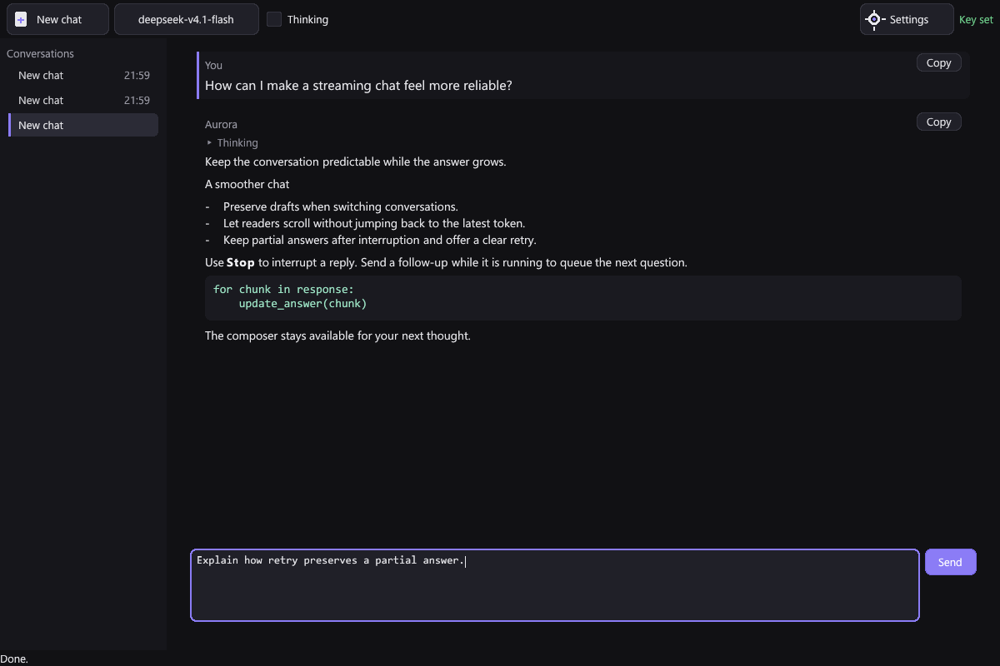
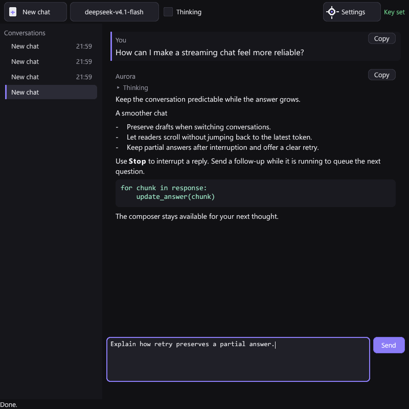
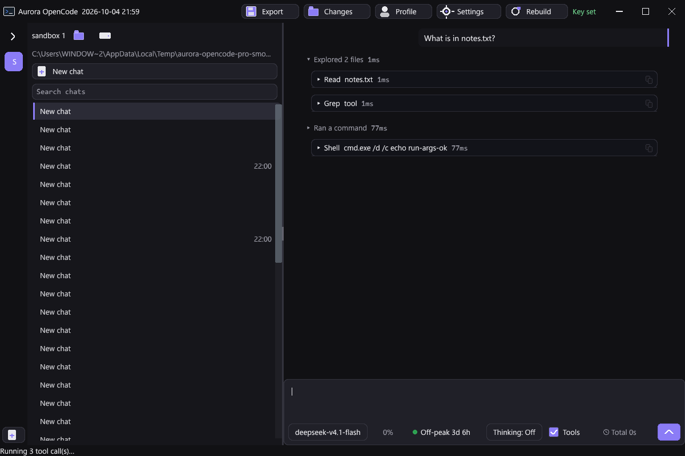
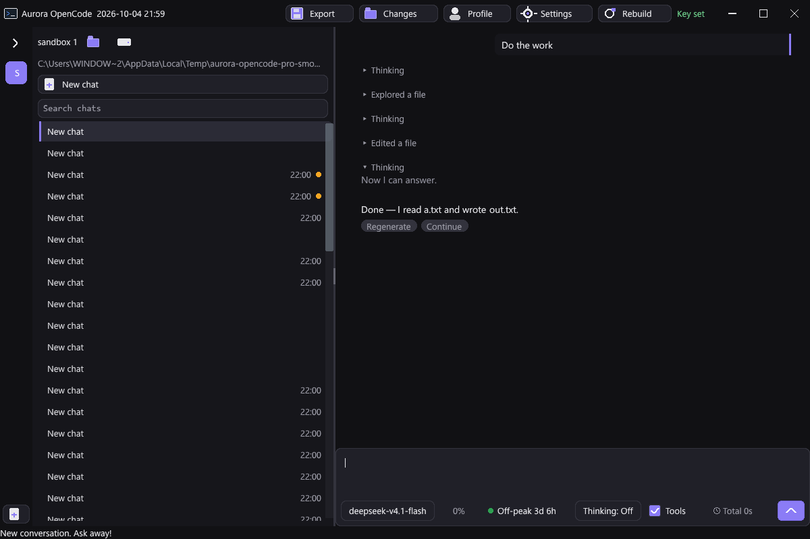

# OpenCode chat review

The review covers the shared transport, the baseline chat UI, and Pro's chat lifecycle and recovery. Existing provider defaults, concurrent Pro conversations, message branches, and tool execution remain integrated with the changes.

## Changes

- Streaming reads only available network bytes. Short tokens appear promptly, and `[DONE]` ends the request even when the server keeps the HTTP body open.
- Provider errors, malformed stream records, incomplete EOF, and invalid tool indexes produce explicit failures. Tool arguments cut off by output limits are never executed.
- Requests retain the endpoint, credential, and session identity that were active when submitted. A model refresh requested during another refresh runs afterward with the latest provider settings.
- Cancellation and shutdown have explicit handle ownership. Parent sessions stay alive until workers release their child connections.
- Terminal events are published only after the worker releases its busy state, so immediate tool continuations and queued follow-ups can start reliably.
- Request preparation shares immutable text and image payloads while detaching mutable arrays. Background conversation saves also detach message, plan, queue, and attachment arrays to avoid racing with subsequent edits.
- Pro checkpoints composer drafts during active turns, including explicit draft clearing. Recovery restores those checkpoints independently of the full transcript snapshot.
- Provider diagnostics are stored separately from assistant prose and persist in snapshots and the journal. Subsequent model requests do not replay these diagnostics as answers.
- Pro trusts positive context limits reported by the configured server, including limits smaller than the model catalog maximum. Per-model discovery survives chat/model switching.
- Model and provider dropdowns close on their second click. Failed usage refreshes show their failure while retaining previous values.
- Composer and transcript copying supply Aurora's active window to the Windows clipboard writer. The previous null owner could clear the clipboard and then fail to export the text, as described by [Microsoft's OpenClipboard reference](https://learn.microsoft.com/en-us/windows/win32/api/winuser/nf-winuser-openclipboard). Headless editor tests use only their process-local clipboard.
- Progress timers start at zero instead of D's default `NaN`, fixing frozen tool indicators and initializing sidebar, thinking, hover, and mini-chat timers.
- Windows paths retain their backslashes in Markdown. File/folder context actions remain available when the path is selected, and relative transcript paths resolve against the active conversation's workspace.
- The baseline UI has a centered reading column, multiline composer, role labels, answer copying, collapsed thinking, explicit retry and jump-to-latest controls, per-chat drafts, durable follow-up queues, and debounced atomic persistence.
- Baseline responses stay attached to their originating conversation after navigation. Late request events are ignored, adjacent deltas are batched, scrolling preserves the reader's position, and blank Enter leaves an active reply running.

## Verification

The complete checks passed on 2026-10-04. Both native release builds succeeded. Pro rebuilt through its stock supervisor, relaunched as PID 14328, and had a visible window; both executables were newer than their source inputs. [verification.json](verification.json) records the checked build timestamps and scope. Pro's standard release uses the installed Windows runtime; its optional Forge publisher skipped publication because this was not a portable build.

Run from the repository root with DMD/DUB and Python on PATH:

```text
python -X utf8 scripts/check-opencode-chat.py --pro
python -X utf8 scripts/check-opencode-http.py --compare
```

The first command runs shared module unit tests, SSE parser regressions, baseline UI regressions, and the Pro headless suite. The existing baseline headless smoke test is also run. The unit runner invokes DMD directly because the vendored context-menu module already supplies a unit-test entry point that conflicts with DUB's generated test main.

The HTTP checks use a local server and the actual WinINet reader. They cover fragmented Unicode, completion on an open body, short tokens arriving before completion, incomplete EOF, provider failures, truncated tools, cancellation followed by resend, active shutdown, and provider changes during model discovery.

The baseline screenshots are rendered at 1200 and 800 pixels wide and visually inspected. Pro's tool and multi-round reasoning screenshots are also visually inspected. They are regression fixtures, including the wide sidebar and numerous synthetic chats created by the suite. Pro's headless suite covers concurrent conversations, branching, drafts, tool results, context controls, selection, scrolling, and failure/retry behavior.

## Performance evidence and limits

[request-snapshot-benchmark.json](request-snapshot-benchmark.json) records a synthetic 24 MiB request containing answer text, reasoning text, and an image payload. It compares the client at the recorded Git commit with the working source. The measured interval is the synchronous call that prepares and launches a request on the UI thread; it excludes serialization on the worker, network transfer, and model inference. Do not interpret its speedup as faster model generation.

Across three trials, median request preparation fell from 8.223 ms to 0.091 ms. Immutable payload sharing avoids redundant copies; mutable request arrays remain detached.

The local HTTP fixture deliberately holds the body open for three seconds after completion. The regression requires completion within 1.5 seconds and receipt of short tokens before a one-second response finishes. These checks measure transport behavior, not the latency of hosted providers.

Paid provider end-to-end quality and real production workloads were not benchmarked. The baseline remains a single-request client; Pro retains its per-conversation concurrent runtimes.








