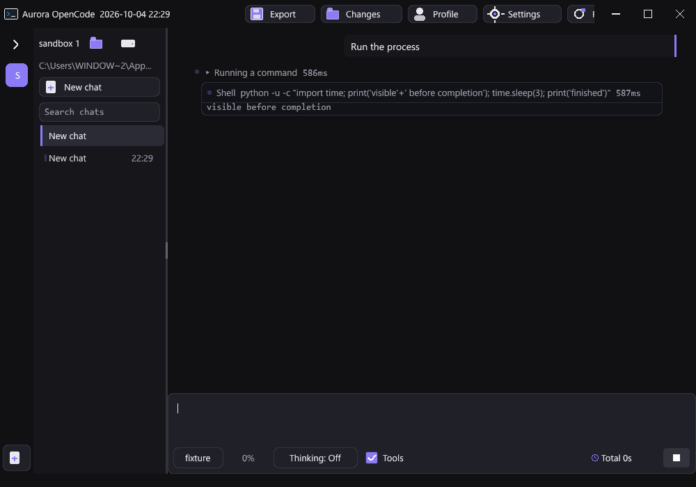
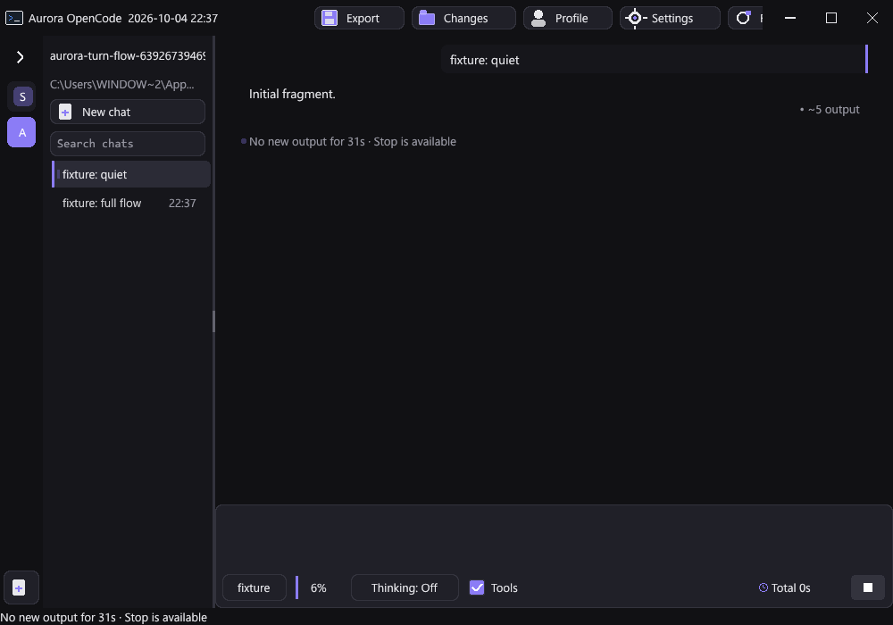

# Aurora OpenCode Pro flow improvements

This review targets the remaining gaps in Pro's chat execution and visibility after the earlier shared transport review. The existing conversation graph, per-chat concurrent requests, tool grouping, and reading position behavior remain integrated.

## Fixed

- Foreground `run` and shell commands publish live output snapshots about four times a second when their captured output changes. The visible preview shows the latest eight lines and survives transcript rebuilds and chat navigation. Post-edit verification hooks use the same reporting path. Output snapshots never count as completed tool results or enter the model's history.
- Read-only tools report their results as they finish. A slow peer no longer hides completed work. Transcript grouping still renders results in request order; mutations and command execution retain their existing barriers.
- Every tool batch owns a fresh cancellation token. Starting another batch cannot clear an abandoned worker's Stop request. Cancelled calls are rejected before execution and again after acquiring the workspace mutation lock.
- Tool exceptions and worker launch failures produce failed results rather than leaving a pending tool count with no result. Commands clean up processes and handles on failure, and output-observer exceptions cannot abandon the running command.
- Large command output uses bounded beginning/end reads instead of loading the entire log into memory. The complete raw log is copied to the existing output store and returned as a pageable file reference. A capture/storage failure keeps the original file and reports a useful reference instead of silently discarding it.
- Waiting before the first token and provider retries are visible in the transcript. After 30 seconds without new reply text, a wait advisory explains that the provider has stopped sending output and that Stop remains available. New text clears it; it is not an automatic timeout.
- The composer describes Enter's steering behavior while a task is active. Its Stop button continues to stop explicitly.
- Idle background runtimes no longer swap their handler state every frame. Pending events, active tools/requests, title generation, compaction, and scheduled work still get serviced. Periodic context-meter refresh runs five times a second; explicit state changes still refresh immediately.
- Automatic resend is ticked only in its owning runtime, so an unrelated busy conversation cannot delay that retry.

## Verification

Run from the repository root:

```text
python -X utf8 scripts/check-opencode-chat.py --pro
python -X utf8 scripts/check-opencode-http.py
python -X utf8 aurora-opencode-pro/benchmarks/chat_ticks.py
```

The Pro check now includes the existing consistency suite, a new process/UI suite, and a real local HTTP provider driving the actual Pro root. The fixture checks submission, live command output before completion, queued steering received exactly once, tool-result delivery, final answers, visible quiet-provider recovery, and Stop/resend with delayed old output. The process suite also checks valid Unicode previews, observer failures, a 12 MB retained log with a bounded preview, cancellation before file changes, and navigation/rebuild preservation. The broader tools suite was run separately, including post-edit hooks and process supervision.

The shared/core and baseline regressions also passed. Native release build and relaunch evidence is recorded in [verification.json](verification.json).

The final standard release rebuilt successfully and relaunched with a visible window. Verification checks the exact running executable and confirms it is newer than every application/shared/core/vendor source input. The optional portable publisher skipped this standard runtime-dependent build.

## Measured performance

[chat-ticks.json](chat-ticks.json) compares against the recorded Git commit using 100 idle conversations and a selected conversation with 1,502 messages. Each of five trials measures 300 root/widget ticks. Painting, persistence, network latency, and provider inference are excluded.

The initial comparison measured median tick time at 1,159 µs before and 46 µs after; median trial p95 fell from 6,294 µs to 2,779 µs. The report is reproducible with the command above. These numbers describe the synthetic UI scheduling workload, not overall application speed or model generation.

Child programs control when their stdout is flushed; buffered programs may still reveal output in bursts. Hosted-provider answer quality and production workloads were not benchmarked in this pass.




