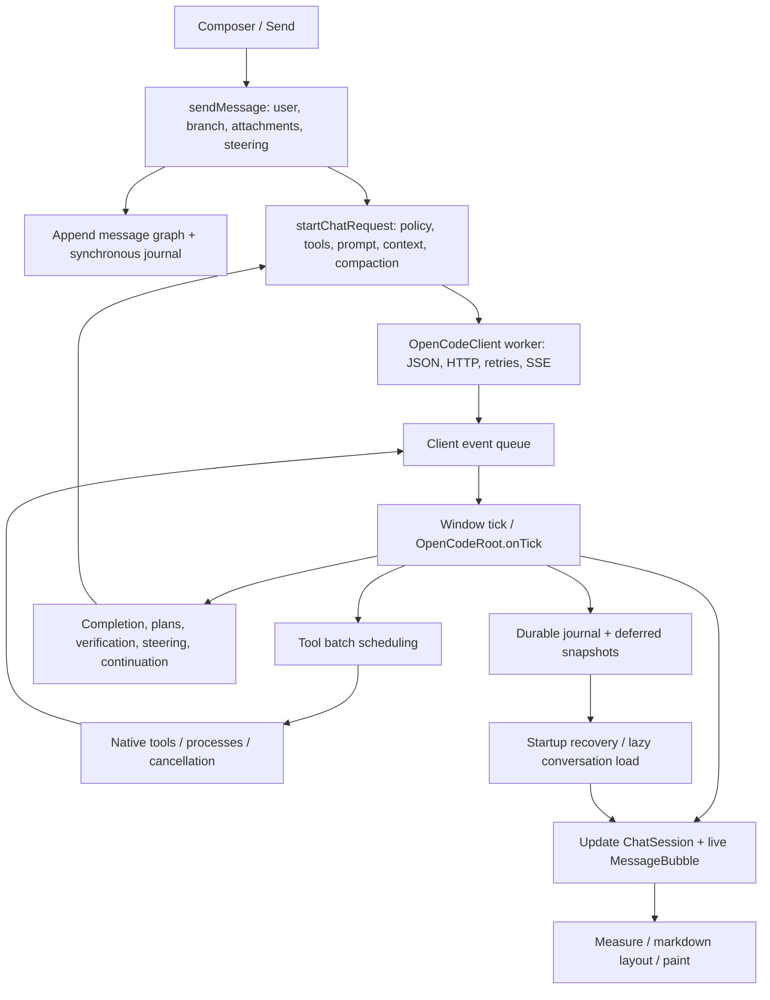
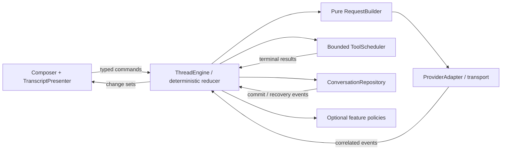

# Message-to-response architecture review

Reviewed 2026-10-06 at commit `910ba3c7081c83b27ba1053b149f4824b225cda8`.
Scope: Aurora OpenCode Pro, its sibling core library, and the Aurora window/tick boundary. This is an audit and migration proposal; production code was not changed or rebuilt for it.

## Recommendation

Replace the execution coordinator inside `OpenCodeRoot` with a conversation engine that runs independently of UI ticks. Replace transcript reconstruction with a presenter that updates stable rows and virtualizes the viewport. Give persistence and tool scheduling their own owners. Retain the existing native tools, conversation graph, streaming parser, incremental markdown composer, and recovery formats while migrating.

A whole-application rewrite would discard useful work and make regressions hard to isolate. The important rewrite is ownership: one owner for execution state, one for durable storage, one for tool jobs, and a UI that presents their results. The current `AgentRuntime` is a durable event journal, not an autonomous execution engine.

## Current path, end to end

| Stage | What actually happens | Main ownership or cost concern |
| --- | --- | --- |
| Input | Composer callbacks and Send invoke `sendMessage`. Busy sends can become steering; explicit queued follow-ups have a separate path. Attachments and edited-message branches are prepared before the request. [1] | Input handling also resets execution flags and selects task policy. |
| Transcript | `appendMessage` assigns an ID and parent, advances the active leaf, and publishes an item-added event synchronously. The visible user bubble is added. [2] | User intent, durable I/O, graph mutation, and presentation share a call stack. |
| Request preparation | `startChatRequest` loads history if needed, checkpoints task state, selects tool definitions, creates the system prompt, compacts history, estimates context, resolves routing/model details, records turn state, and starts the client. [3] | Large policy surface in a widget; preparation can perform synchronous loading and journal writes. |
| Context projection | `buildRequestMessages` follows the active branch, applies image budgets, admits tool-call wrappers only with their matching results, and filters orphan results. Internal control messages have special role handling. [4] | Correctness rules are useful; projection and policy should be independently testable and cacheable. |
| Client launch | `startChatMessages` copies mutable request metadata while sharing immutable string payloads, then starts a worker. It silently returns if busy/closed. The caller still sets its active request fields. [5] | No explicit accepted/rejected launch contract. This is a potential waiting-state defect, not a reproduced cause of every reported hang. |
| Transport | The worker builds provider JSON, may do tokenizer preflight, sends HTTP, reads SSE, handles provider/reasoning quirks, and retries. Windows uses synchronous WinINet operations. [6] | Transport, provider compatibility, retry policy, and request lifecycle are intertwined. |
| Parsing and queue | SSE processing produces reasoning/content/tool/usage events. Adjacent text deltas are already coalesced; adjacent usage/tool snapshots can replace stale snapshots. The pending array has no explicit byte bound. [7] | Coalescing helps but is not backpressure. Full text also exists in client accumulation buffers. |
| Event application | `onTick` iterates active conversations, swaps their state through root scratch fields, drains queues, rejects stale request IDs, applies deltas/tool results, and decides completion/retry/continuation. [8] | Application progress depends on a UI tick. Event processing has no explicit per-frame byte/time budget. |
| Live text | Deltas append to `ChatMessage` UTF-8 strings and to the bubble's display buffers. Footer, scroll, tooltip, and layout state update here. [9] | Model, client, and presentation retain separate text representations. Optimize only with measured allocation evidence. |
| Tool execution | Tool calls attach to the assistant item. Guards run, an owned cancellation token is created, and a worker dispatches batches. Eligible read operations use up to four owned lanes; exclusive operations preserve order. Results return through the client queue. [10] | Per-batch threads, no shared global scheduler; tool progress and settlement still depend on root tick processing. |
| Tool settlement | Results are matched by ID, duplicates rejected, pending calls removed, tool messages appended, task/verification state updated, and the next model request started when the batch settles. [11] | Settlement, plans, validation, hidden guidance, and another network round are coupled. |
| Completion | Assistant state is finalized and journaled. A finished HTTP round can lead to another round for steering, plans, verification, orchestration, or computer use. Quick-title and model-compaction requests have separate clients. [12] | A transport round, a user turn, and a durable task need distinct state machines. |
| Stop | The active request ID is invalidated before cancellation. I/O is closed, busy clients can be retired, pending tool state is settled, and the UI returns promptly. [13] | Keep late-event rejection and prompt stop. Logical cancellation does not guarantee immediate physical worker termination. |
| Rendering | Structural changes can rebuild the message column: preserve selection/live nodes, clear children, reconstruct the materialized page, and recompute groups/layout. The page initially limits history to 120 messages. [14] | History paging is not viewport virtualization. Rebuilding a page revisits rows outside the viewport. |
| Recovery/storage | The journal records thread/turn/item events; snapshots copy session structures on the UI thread, then serialize on a worker. The store writes every materialized conversation. Selecting unloaded history parses its file synchronously. [15] | Storage is partially asynchronous, but the UI still performs copying, loading, and durable appends. |

## What the measurements establish

These are local optimized test executables with isolated state, not measurements of a production provider session.

| Check | Result | Interpretation |
| --- | --- | --- |
| Existing tick fixture: 100 conversations, selected conversation with 1,502 messages, five trials of 300 ticks | Median 34 µs; p95 approximately 400 µs | Idle coordination is currently cheap. State swapping is principally a correctness/maintainability concern, not a demonstrated idle CPU bottleneck. No network or painting is measured. |
| Same fixture, software `UiTestDriver`, 30 samples after warm-up | Cached paint median 52 µs, p95 59 µs; forced transcript rebuild plus paint median 12.620 ms, p95 13.010 ms | Structural rebuilds dominate this comparison. Rows contain short text; long markdown, diffs, images, and active streaming were not benchmarked here. This is not an FPS or input-latency measurement. |
| Existing `chat_consistency_smoke.d` | Original fixture fails the parallel-order assertion | The fixture paints without servicing a deferred rebuild tick. |
| Temporary copy of that fixture, with `tickTree(0.02)` before each paint | All four checks pass: streaming bottom, active tool details, parallel request order, history scroll position | Evidence supports a test scheduling mismatch, rather than a reproduced runtime ordering defect. Original test source was not changed. |
| Historical tail of the live error log | 14,408 `measureThinking` records among 22,573 lines examined; busiest observed second had 66 such records | Frequent synchronous diagnostic writes are real. This historical sample does not measure their share of frame time. |

The separate paint/tick executable also reproduced tick medians of 34–35 µs and p95 of 386–399 µs. The earlier parallel-tool closure fix is already in the reviewed commit; this audit does not reintroduce or re-diagnose that fixed bug.

## Highest-priority findings

### 1. The UI owns execution progress

`ConversationRuntime` contains execution fields and widget references. `saveLoadedRuntime` and `loadRuntime` copy dozens of fields between each conversation and shared root fields. `onTick` is the effective scheduler for provider events, tool settlement, retries, and continuation. [8]

The framework deliberately skips application ticks during native border resizing. Provider workers can continue queuing events while application settlement pauses. [16] This is a concrete reason to move execution off the presentation clock, even when ordinary idle ticks are fast.

Rewrite this coordinator first. Use one `ThreadEngine` per conversation, owned by a scheduler with serialized mailboxes. Commands should include Send, Steer, QueueFollowUp, Stop, Retry, and SelectBranch. Events should carry thread, turn, request, item, sequence, and revision identities. A deterministic reducer owns state; effects invoke transport, tools, and persistence. Widgets hold view state and subscribe to change sets.

Do not substitute one giant global engine object for the root. Define separate round, turn, and task states; make transitions and reasons explicit. Background conversations should progress without being selected or rendered.

### 2. Transcript reconstruction is the clearest measured rendering cost

Deferred rebuild coalescing, history paging, reusable live nodes, layout caches, and incremental markdown already exist. Preserve them during migration. The markdown composer commits stable blocks and handles unfinished fenced content; proposing an incremental parser from scratch would duplicate existing work. [14]

Replace clear-and-recreate rendering with a `TranscriptPresenter` keyed by stable item ID and revision. Update only affected rows and group headers. Virtualize the viewport with overscan and a height index. Anchor scrolling to an item ID and offset, rather than reconstructing the whole visible history page to recover position.

Keep text shaping and markdown buffers owned by the presenter. Audit layout-cache keys and eviction: the shared cache currently has 160 entries, uses text/width comparisons, and copies stored text. An ID/revision/layout-environment key with a memory budget is clearer, but its speedup still needs measurement. [14]

### 3. Diagnostic logging performs disk work from measurement

`measureThinking` calls activity logging. The crash guard throttles paint-prefixed entries, but measurement entries do not match that throttle. Alternating layout widths can defeat identical-message suppression. The logger takes a mutex and opens, writes, flushes, and closes the file per record. Rotation happens at logger initialization. [17]

This is an immediate, small fix before any architectural rewrite: retain recent crash breadcrumbs in a bounded in-memory ring; sample noisy diagnostics; drain logs through an asynchronous writer with bounded buffering and ongoing rotation. Errors and intentional durable records need an explicit flush policy. Do not just silence diagnostics and lose useful evidence.

### 4. “Verification passed” is inferred from command words

A successful `run`/`bash` result satisfies verification if its arguments contain words such as `build`, `test`, or `check`. A successful command that merely echoes one of those words meets the predicate. [11] This is a static correctness defect, not a performance issue.

Replace substring inference with structured verification evidence: command/check identity, workspace, artifact revision, exit status, and captured outcome. A new substantive mutation invalidates earlier evidence. Ordinary tool success must not silently become a completed task. Explicit user-facing status should distinguish required, running, passed, failed, and unverified.

### 5. Durability is uneven during long responses

The initial assistant item is journaled before it contains text. Stream deltas update memory and the bubble; the full updated item is published at settlement. General snapshots are deferred while any turn is busy. A crash during a long partial stream can therefore lose text already displayed since the last durable item update. [2][9][15]

Use a single `ConversationRepository` writer. Batch partial-response checkpoints by elapsed time/bytes, snapshot only dirty conversations, and report a committed high-water mark. Keep intent durable before executing effects that need recovery. Distinguish accepted input from durably stored input if writing asynchronously.

Store attachments once as referenced blobs instead of repeatedly placing base64 image data in item payloads and snapshots. The journal payload currently includes image base64. Move history loading off the UI thread, with explicit Loading/Error states. Serialize shutdown through the storage owner: the current shutdown wait has a timeout after which synchronous persistence can proceed while the previous writer may still be running. [15]

Keep the existing recovery readers during migration. A database is an option if transactional requirements justify it; introducing one is not required to remove synchronous UI I/O.

### 6. Request policy lacks explicit acceptance and complete cache identities

The client launch function returns no acceptance result, despite a busy/closed early return. The UI must not transition to Waiting unless launch was accepted. Catch worker-start failures and emit a terminal outcome. [5]

The system-prompt cache key includes workspace, platform, verbosity, date, native mode, and self-project status, but omits capability/settings generation. Prompt text depends on feature flags such as web search and computer use. Changing a flag can leave prompt text stale while the tool set changes. [18]

Extract a pure `RequestBuilder` over an immutable conversation snapshot. Resolve the effective model/capabilities before final context accounting. Use a prompt fingerprint covering the enabled tool schemas, settings, registered modules, feature flags, and other prompt inputs. Cache branch projection by graph revision, active leaf, and checkpoint revision. Preserve tool-result pairing and multimodal role rules.

### 7. Tool and transport resources need bounded ownership

Owned parallel tool lanes now avoid the fixed loop-capture bug. Build on that fix: a shared bounded `ToolScheduler`, per-workspace mutation lanes, and exactly one terminal result per accepted call ID. A UI-cancelled job can still be physically running; represent both facts, and prevent unsafe mutations from overtaking a still-running cancelled mutation. [10][13]

Native calls that cannot be interrupted may require process isolation; spawned command trees can use Windows Job Objects. Keep the existing native tools rather than wrapping everything in shell commands. Use desktop leases and explicit execution contexts for computer use instead of request routing through shared global state. The emergency stop latch can remain deliberately global.

The event queue needs byte limits or bounded chunk storage, not only a count limit: one coalesced text event can itself become very large. Never drop text or terminal events. Keep latest-value semantics only for replaceable progress snapshots. Give UI subscriptions bounded work per frame; the engine should continue settlement independently.

Retry policy is split between client HTTP recovery and root resend logic. In particular, the client intentionally permits continuing 429 retries. [6] Consolidate policy around typed retry reasons, cancellation, visible backoff, and a user-configurable time budget. Preserve legitimate long work; do not replace clear state with arbitrary universal round limits.

## Proposed boundary layout

Quick titles, orchestration, computer use, and compaction should be optional policy/effect components rather than extra branches scattered through the widget. A provider adapter owns wire JSON, SSE variations, usage interpretation, and provider-specific recovery; the engine owns whether to continue a user task. Evaluate WinHTTP or another cancellable transport after these boundaries exist and cancellation is measured. Neither a new language nor a new graphics framework is supported by the current evidence.

## Migration order and proof gates

| Stage | Deliverable | Required evidence before replacing the old path |
| --- | --- | --- |
| 1: Baseline and narrow defects | Repair deferred-tick test assumptions; correlation traces; sampled logging; request acceptance; complete prompt fingerprint; explicit verification evidence | Original behavior fixtures pass; launch rejection cannot hang; capability changes update prompts; an `echo build` success cannot pass verification. |
| 2: Engine extraction | Typed state and deterministic reducer; direct per-conversation ownership; effects behind adapters; engine scheduling independent of UI | Recorded provider/tool traces replay to the same transcript; background chats progress during resizing; stop blocks late events and retry resurrection; no root field swapping. |
| 3: Repository and scheduler | Single storage owner, dirty-thread snapshots, partial checkpoints, bounded tool pool and desktop/workspace leases | Crash/restart tests preserve accepted intents and correct pending/completed jobs; cancelled mutations cannot overlap unsafely; resource counts remain bounded across repeated stop/retry. |
| 4: Presenter replacement | Stable row updates, viewport virtualization, scroll anchoring, asynchronous history load | Long transcript selection, branch edits, tools, reasoning, markdown, images, and load-older retain correct position; sustained streaming does not reconstruct unaffected rows. |
| 5: Transport renewal if needed | Separate provider adapters and measured cancellation/preflight improvements | Provider conformance fixtures cover EOF, partial tools, usage, retries, cancellation, and reasoning formats; measured benefit justifies transport replacement. |

Proposed performance targets, not current guarantees: p95 input-to-visible-action under 50 ms; frame work within the selected refresh-rate budget; no disk writes from measure/paint; UI event application limited to a few milliseconds per frame; bounded provider queue bytes and tool concurrency; cost of displaying a 10,000-message history dominated by viewport rows rather than history length. Define a documented maximum partial-text loss window for crash recovery.

Measure separately: Send-to-request-start, provider time-to-first-byte, first-byte-to-first-paint, tool queued/start/finish/settlement, queue bytes, reducer work, layout/rebuild work, durable commit latency, allocation/GC pauses, and worker counts. Provider delay should not be counted as UI inefficiency.

## Preserve these existing strengths

- Message IDs, parent graph, active-branch projection, and request-ID filtering.
- Owned tool jobs and cancellation tokens, duplicate-result rejection, ordered result presentation, native edit/diff safeguards.
- Release of client busy/I/O state before terminal events, and rejection of incomplete tool arguments at premature stream end.
- Adjacent delta coalescing, exact-context accounting paths, image budgets, and compaction that retains the original transcript.
- Incremental markdown composition, stable live-widget reuse, existing scroll/selection behavior, and recovery compatibility.

The architecture should make these contracts explicit and testable. More parallelism alone would not have prevented the previous ownership bug.

## Source references

Links point to the reviewed workspace; line numbers are baseline anchors.

[1]: <C:/Users/Windows10_new/Documents/github_repositories/aurora-gui/aurora-opencode-pro/source/auroraopencode/appui.d:16375>
[2]: <C:/Users/Windows10_new/Documents/github_repositories/aurora-gui/aurora-opencode-pro/source/auroraopencode/appui.d:12237>
[3]: <C:/Users/Windows10_new/Documents/github_repositories/aurora-gui/aurora-opencode-pro/source/auroraopencode/appui.d:18217>
[4]: <C:/Users/Windows10_new/Documents/github_repositories/aurora-gui/aurora-opencode-pro/source/auroraopencode/appui.d:17925>
[5]: <C:/Users/Windows10_new/Documents/github_repositories/aurora-gui/aurora-opencode-core/source/auroraopencode/opencode_client.d:673>
[6]: <C:/Users/Windows10_new/Documents/github_repositories/aurora-gui/aurora-opencode-core/source/auroraopencode/opencode_client.d:1021>
[7]: <C:/Users/Windows10_new/Documents/github_repositories/aurora-gui/aurora-opencode-core/source/auroraopencode/opencode_client.d:848>
[8]: <C:/Users/Windows10_new/Documents/github_repositories/aurora-gui/aurora-opencode-pro/source/auroraopencode/appui.d:24430>
[9]: <C:/Users/Windows10_new/Documents/github_repositories/aurora-gui/aurora-opencode-pro/source/auroraopencode/appui.d:14167>
[10]: <C:/Users/Windows10_new/Documents/github_repositories/aurora-gui/aurora-opencode-pro/source/auroraopencode/appui.d:15506>
[11]: <C:/Users/Windows10_new/Documents/github_repositories/aurora-gui/aurora-opencode-pro/source/auroraopencode/appui.d:15706>
[12]: <C:/Users/Windows10_new/Documents/github_repositories/aurora-gui/aurora-opencode-pro/source/auroraopencode/appui.d:14406>
[13]: <C:/Users/Windows10_new/Documents/github_repositories/aurora-gui/aurora-opencode-pro/source/auroraopencode/appui.d:16108>
[14]: <C:/Users/Windows10_new/Documents/github_repositories/aurora-gui/aurora-opencode-pro/source/auroraopencode/appui.d:12379>
[15]: <C:/Users/Windows10_new/Documents/github_repositories/aurora-gui/aurora-opencode-pro/source/auroraopencode/appui.d:22801>
[16]: <C:/Users/Windows10_new/Documents/github_repositories/aurora-gui/vendor/aurora-d-0.4.5/source/aurora/window.d:801>
[17]: <C:/Users/Windows10_new/Documents/github_repositories/aurora-gui/aurora-opencode-core/source/auroraopencode/logging.d:77>
[18]: <C:/Users/Windows10_new/Documents/github_repositories/aurora-gui/aurora-opencode-pro/source/auroraopencode/appui.d:18191>

Additional anchors for follow-up implementation:

- [ConversationRuntime and its widget/execution fields](<C:/Users/Windows10_new/Documents/github_repositories/aurora-gui/aurora-opencode-pro/source/auroraopencode/appui.d:8946>), [state swapping](<C:/Users/Windows10_new/Documents/github_repositories/aurora-gui/aurora-opencode-pro/source/auroraopencode/appui.d:9619>).
- [Measurement logging](<C:/Users/Windows10_new/Documents/github_repositories/aurora-gui/aurora-opencode-pro/source/auroraopencode/appui.d:1691>), [activity throttling](<C:/Users/Windows10_new/Documents/github_repositories/aurora-gui/aurora-opencode-pro/source/auroraopencode/crashguard.d:89>).
- [Verification predicate](<C:/Users/Windows10_new/Documents/github_repositories/aurora-gui/aurora-opencode-pro/source/auroraopencode/appui.d:15912>), [feature-dependent prompt text](<C:/Users/Windows10_new/Documents/github_repositories/aurora-gui/aurora-opencode-pro/source/auroraopencode/systemprompt.d:342>).
- [Journal append](<C:/Users/Windows10_new/Documents/github_repositories/aurora-gui/aurora-opencode-core/source/auroraopencode/runtime.d:146>), [async snapshots](<C:/Users/Windows10_new/Documents/github_repositories/aurora-gui/aurora-opencode-pro/source/auroraopencode/appui.d:22881>), [snapshot deferral](<C:/Users/Windows10_new/Documents/github_repositories/aurora-gui/aurora-opencode-pro/source/auroraopencode/appui.d:24886>), [lazy history loading](<C:/Users/Windows10_new/Documents/github_repositories/aurora-gui/aurora-opencode-pro/source/auroraopencode/appui.d:23391>).
- [Tick fixture](<C:/Users/Windows10_new/Documents/github_repositories/aurora-gui/aurora-opencode-pro/benchmarks/chat_tick.d>), [UI consistency fixture](<C:/Users/Windows10_new/Documents/github_repositories/aurora-gui/aurora-opencode-pro/tests/chat_consistency_smoke.d>).
