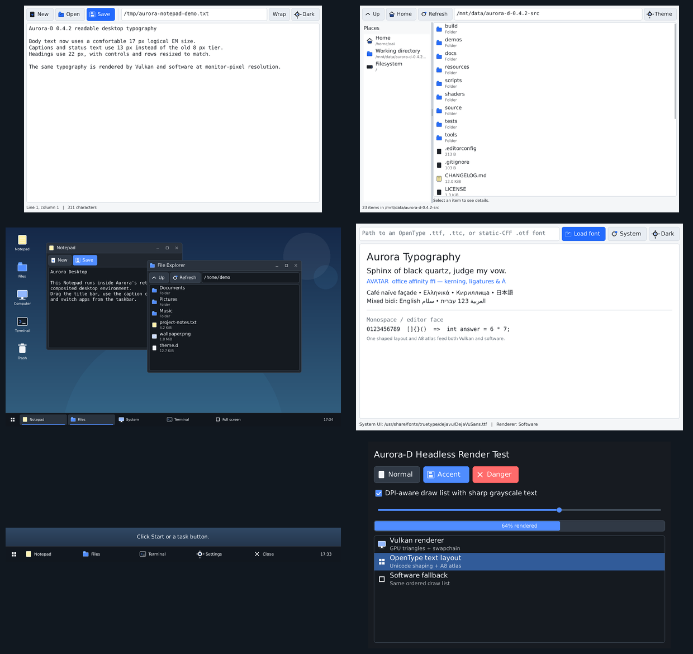
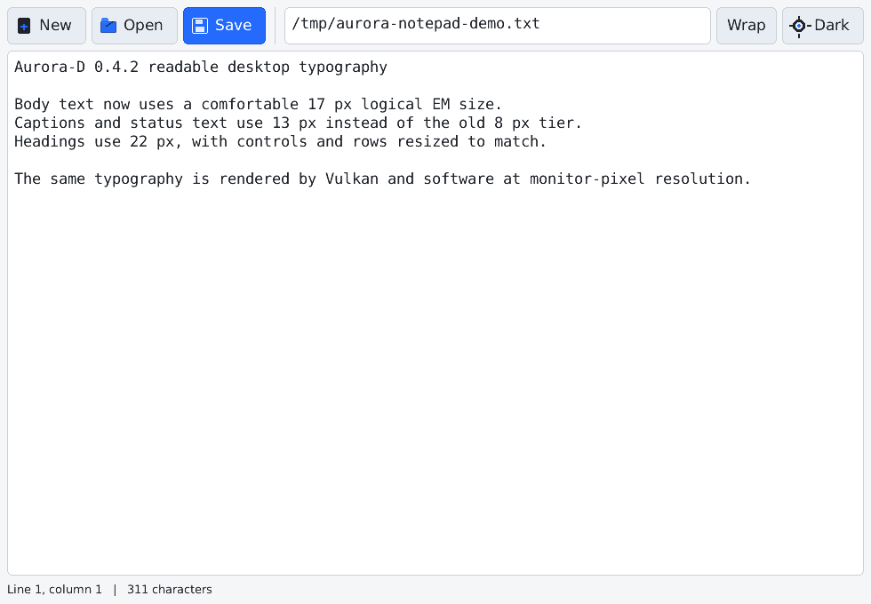
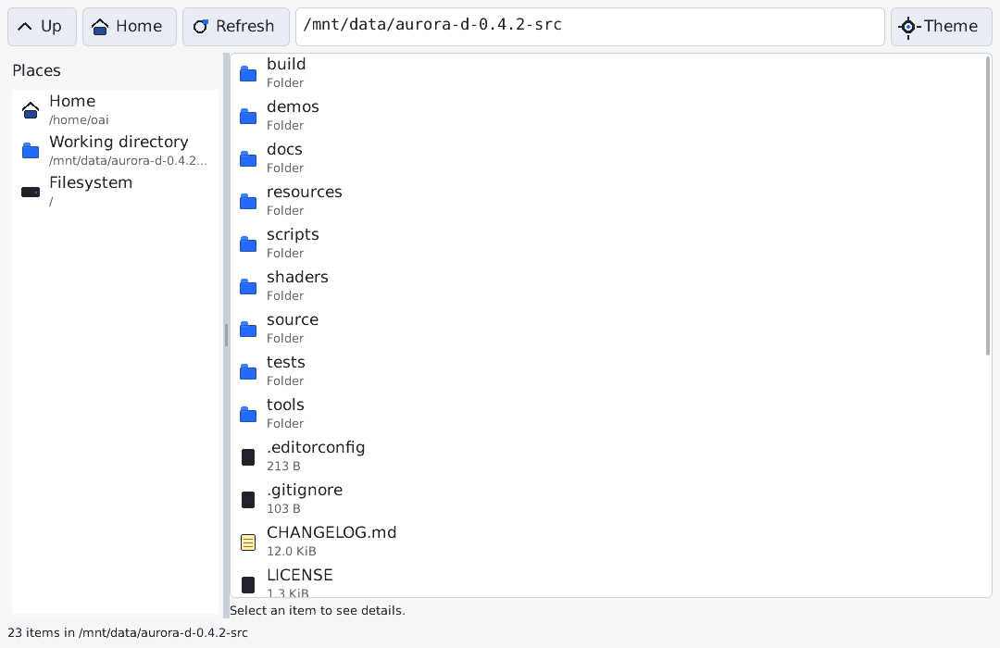
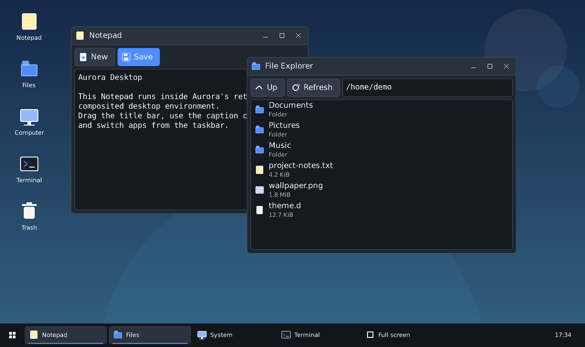
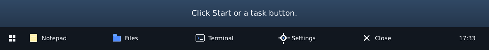
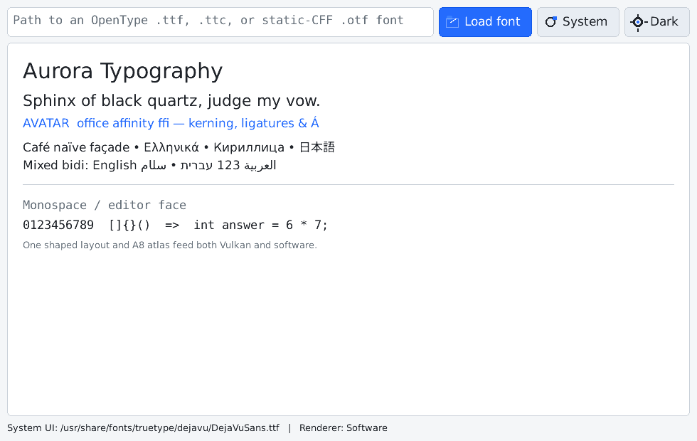

# Aurora-D

Aurora-D is a compact cross-platform graphics and retained-mode GUI library written in D. Version 0.4.5 makes taskbar reordering a true pointer-locked compositor interaction: the grabbed task is rendered as an independently retained drag proxy, its original grab point remains directly under the latest sampled pointer, neighbouring tasks preview an insertion gap without mutating the model, and the stable task order commits once on release. The measured Start menu, root-level click-away protocol, stable task identities, and validated persisted ordering from 0.4.4 remain in place. Every Desktop Environment window, task, menu, control, popup, and drag pointer remains inside one native host window. Text uses the readable 13/17/22/30 logical-pixel ramp and is rasterized at the monitor's physical DPI by both Vulkan and software renderers.



There are no third-party DUB package dependencies. Aurora reads fonts and Unicode data itself; it does not call FreeType, HarfBuzz, ICU, DirectWrite, CoreText, or another text library. Native builds link only the operating-system libraries listed in `dub.json`. Vulkan is resolved dynamically at runtime.

## Included features

### Rendering

- Renderer-neutral `DrawList` containing indexed triangles, vertex colors, texture coordinates, and ordered clip batches.
- `RenderScene` retained compositor with a base draw list plus independently revisioned Aurora layers whose positions and z-order are separate from their content.
- Vulkan 1.0 renderer with persistent per-layer vertex/index buffers, dynamic viewport/scissor transforms, native WSI surfaces, swapchain recreation, R8 glyph-atlas upload, alpha blending, and presentation.
- Software renderer with cached base/layer ARGB surfaces, providing the same transform-only composition contract for deterministic fallback and tests.
- Automatic Vulkan selection with software fallback when a loader, device, queue, extension, or presentation surface is unavailable.
- Rectangles, borders, gradients, thick lines, circles, rounded rectangles, procedural icons, and text.
- Deterministic headless rendering and PPM screenshots.

The Vulkan path does not upload a CPU-rendered window image. Widgets and `Canvas` produce geometry; Vulkan rasterizes that geometry and samples the shared glyph atlas. Glyph outlines are rasterized once on the CPU when first requested, then cached.

### Unicode and text

- Official Unicode 17.0 property data generated into compact D tables.
- Extended grapheme clusters from UAX #29, including emoji ZWJ sequences, regional-indicator flags, and Indic conjunct boundaries.
- Unicode Bidirectional Algorithm from UAX #9 through visual reordering, including embeddings, overrides, isolates, bracket pairing, weak/neutral resolution, mirrored characters, and dual visual carets at bidi boundaries.
- Unicode line-break opportunities from UAX #14, with hard breaks, soft wrapping, combining sequences, emoji, and East Asian classes.
- Script itemization and ordered font fallback resolved for a complete grapheme cluster.
- OpenType script/language/feature selection.
- GDEF glyph classes, mark sets, and ligature caret data.
- GSUB single, multiple, alternate, ligature, contextual, chaining-contextual, extension, and reverse-chaining substitutions.
- GPOS single, pair, cursive, mark-to-base, mark-to-ligature, mark-to-mark, contextual, chaining-contextual, and extension positioning.
- Arabic joining feature masks for isolated, initial, medial, and final forms.
- Legacy `kern` format-0 fallback when GPOS kerning is absent.
- One cacheable `TextLayout` result for Vulkan and software replay, hit testing, selection geometry, caret placement, and visual navigation.

### Font files and rasterization

- `.ttf`, `.otf`, and `.ttc`/OpenType Collection containers.
- TrueType `glyf`/`loca` quadratic outlines, including nested compound glyphs and point attachment.
- Static CFF1 Type 2 charstrings, including local/global subroutines, cubic curves, name-keyed fonts, CID-keyed `FDArray`/`FDSelect` fonts, and common flex/arithmetic operators.
- Unicode `cmap` formats 4 and 12.
- Horizontal metrics from `hhea` and `hmtx`.
- Deterministic nonzero-winding rasterization with 4×4 supersampled grayscale coverage.
- Monitor-pixel glyph rasterization and pixel-snapped atlas quads, avoiding post-rasterization enlargement.
- Portable `sharp` and `smooth` grayscale modes; sharp is the default and increases edge contrast without LCD-order assumptions.
- Growable A8 glyph atlas shared by Vulkan and software.
- Separate UI and monospace collections, with application-provided ordered fallbacks.
- Built-in 5×7 emergency face only when no usable outline face covers a cluster.

### GUI and demos

- Retained widget tree, layouts, focus, content/transform/composition invalidation, z-order, event bubbling, mouse capture, and keyboard traversal.
- Labels, buttons, icon buttons, text fields/areas, list views, checkboxes, sliders, progress indicators, separators, split panes, desktop icons, floating windows, and taskbar controls.
- Light and dark themes.
- Semantic desktop typography tiers: 13 px caption, 17 px body, 22 px heading, and 30 px display text at 96 DPI.
- Text-measured button widths and roomier control, list-row, title-bar, desktop-icon, and taskbar metrics.
- Notepad, File Explorer, Desktop Environment, Taskbar, and Font Gallery applications.
- Text editor with grapheme-safe movement/deletion, Unicode wrapping, bidi-aware hit testing, visual arrow movement, discontiguous bidi selection rectangles, undo/redo, scrolling, and a process-local clipboard.

## Architecture

```text
UTF-32 source text
    │
    ├── grapheme boundaries (UAX #29)
    ├── paragraph bidi levels and visual runs (UAX #9)
    ├── script itemization + cluster-level font fallback
    ├── GDEF / GSUB / GPOS shaping
    └── Unicode line-break opportunities (UAX #14)
            │
            ▼
        TextLayout
        ├── positioned glyphs
        ├── logical and visual runs
        ├── lines and visual clusters
        ├── caret states and affinity
        └── selection / hit-test geometry
            │
            ▼
Widget tree → Canvas → base/layer DrawLists + A8 glyph atlas
                                   │
                                   ▼
                              RenderScene
                        revisions + transforms + z-order
                                   │
                         ┌─────────┴─────────┐
                         ▼                   ▼
                 Vulkan retained       Software retained
                  layer buffers         layer surfaces
                         │                   │
                         └─────────┬─────────┘
                                   ▼
                              host presentation
```

Widgets do not know which renderer is active. A shaped layout can be cached and replayed without reshaping:

```d
auto layout = canvas.layoutText("office العربية עברית"d, 2);
canvas.drawLayout(Point(20, 20), layout, theme.text);
```

For full layout options:

```d
TextLayoutOptions options;
options.role = FontRole.ui;
options.pixelSize = 18;
options.maxWidth = 420;
options.wrap = true;
options.paragraphDirection = ParagraphDirection.automatic;

auto layout = window.fontSystem().textEngine.layout(text, options);
auto caret = layout.hitTestCaret(mouseX, mouseY);
auto selection = layout.selectionRects(firstLogicalIndex, lastLogicalIndex);
```

Logical indices are UTF-32 code-point offsets. Public caret and editing operations snap those offsets to extended grapheme boundaries. `CaretAffinity` distinguishes insertion states that share one logical offset but appear on different visual sides of a bidi boundary or soft wrap.

## Retained Aurora desktop compositor

Aurora's internal desktop windows are not native child windows. `FloatingWindow`, `Taskbar`, and Desktop Environment's Start menu are independently retained Aurora layers inside one host surface.

Moving a layer without resizing it performs no widget layout, paint traversal, text shaping, glyph rasterization, tessellation, or vertex/index upload. Vulkan reuses persistent layer buffers and changes dynamic viewport/scissor state; software reuses a cached transparent layer surface. Aurora also caches the painter-ordered layer array, so repeated drag frames do not traverse the widget tree. Vulkan fence and image availability are checked without waiting, allowing input to continue and the newest transform to replace an older pending one.

During a captured transform drag, Aurora additionally:

- preserves native pointer positions as subpixel logical coordinates;
- samples the current host pointer immediately before command recording/composition;
- keeps a presentation opportunity active even between native motion messages;
- hides the Win32 hardware cursor and renders an Aurora pointer in the same retained scene as the moved window;
- uses two Vulkan frame contexts for MAILBOX/IMMEDIATE without permitting a stale application-side drag queue.

```d
window.resetCompositorStats();
window.resetRendererStats();

floatingWindow.setPosition(Point(300, 160));

CompositorStats ui = window.compositorStats();
RendererStats backend = window.rendererStats();
```

See [Retained compositor](docs/RETAINED_COMPOSITOR.md) for the exact zero-rebuild drag contract, invalidation classes, renderer caches, diagnostics, and Windows interaction command.

## Desktop icons, task reordering, and context menus

Desktop shortcuts now use retained pointer capture and can be moved freely or snapped to the nearest unoccupied grid cell. Dropping one shortcut on another invokes the application-defined `DesktopSurface.onIconDropped` contract; the Desktop Environment demo uses this for Trash and folder-style targets. Shortcut menus expose Open, Rename, Delete, and Properties, while the wallpaper menu includes Refresh, Arrange, Align to grid, New, Display settings, and Personalize.

Task buttons can be picked up from any point and dragged left or right. The visible task follows the pointer by the original grab offset as a separate retained compositor layer, while the taskbar paints an insertion gap and keeps the stable model order unchanged until mouse-up. Late pointer sampling moves the drag proxy and Aurora cursor in the same submitted frame; ordinary pointer samples require only a transform update, and crossing a slot boundary invalidates only the taskbar preview. Window tasks activate, minimize, restore, maximize, close, and track title changes; command tasks can be opened, moved, or removed. Start, clock, task, empty-taskbar, wallpaper, shortcut, and floating-title-bar context menus are drawn by Aurora as clamped full-window overlay layers with keyboard navigation, checked and disabled states, icons, separators, shortcuts, and outside-click dismissal.

```d
desktop.onIconDropped = delegate(DesktopIcon source, DesktopIcon target)
{
    if (target.iconKind() == IconKind.trash)
    {
        desktop.removeIcon(source);
        return true;
    }
    return false;
};

taskbar.onEntryMoved = delegate(int from, int to)
{
    persistTaskOrder(from, to);
};
```

See [Desktop shell interactions](docs/DESKTOP_INTERACTIONS.md) for the complete icon, drop, taskbar, context-menu, keyboard, and persistence APIs.

## Desktop-shell correctness contracts

Aurora 0.4.5 treats transient shell UI and task ordering as explicit state machines rather than ad-hoc widget behavior. `StartMenu` measures its own content, clamps to the client rectangle, scrolls only its application region, and keeps system and power actions in a fixed footer. `PopupController` closes the topmost transient popup before normal hit testing and then redispatches the same outside press to the control underneath. Escape and host focus loss use the same cleanup path.

Taskbar entries use stable `TaskEntryId` values. Pointer reordering does not mutate `_entries` during motion: it tracks the dragged identity, moves a root-level retained drag proxy by subpixel transform, paints the remaining entries around a target gap, commits exactly one model move on release, and emits one persistence notification. `setEntryOrder` restores a complete validated ID order; duplicate, partial, and unknown persisted orders are rejected.

The public `UiTestDriver` sends pointer, keyboard, text, focus, resize, and DPI events through `GuiWindow`, while `auditLayout` reports negative geometry, viewport escapes, undersized controls, and malformed full-client overlays. The desktop-shell regression runs real click-away routing and hundreds of repeated task drags rather than calling widget handlers directly.

See [Desktop-shell correctness](docs/DESKTOP_SHELL_CORRECTNESS.md) for the popup lifecycle, Start-menu sizing rules, stable-order contract, layout standards, and test APIs.

## Platform paths

| Platform | Vulkan presentation | Software presentation |
|---|---|---|
| Linux/X11 | `VK_KHR_xlib_surface`, with XCB fallback | X11 image presentation |
| Windows | `VK_KHR_win32_surface`, physical client extent | Per-Monitor-V2, 1:1 GDI bitmap presentation |
| macOS | `VK_EXT_metal_surface` over `CAMetalLayer` | Core Graphics |
| Headless | not used | in-memory ARGB surface |

macOS needs a separately installed Vulkan loader such as MoltenVK for GPU rendering. Automatic mode uses the software backend when it is absent.

## Desktop typography

Aurora 0.4.5 uses named text tiers rather than deriving all UI text from an undersized arithmetic sequence:

| Tier | Logical EM size | Typical use |
|---|---:|---|
| `TextScale.caption` | 13 px | metadata, status text, secondary labels |
| `TextScale.body` | 17 px | controls, menus, editor text, ordinary labels |
| `TextScale.heading` | 22 px | section headings and prominent window content |
| `TextScale.display` | 30 px | large titles and showcase text |

The default `Theme.fontScale` is `TextScale.body`. Controls and demos use correspondingly larger metrics: standard controls are 38 logical pixels high, list rows default to 44, floating title bars to 40, and the Desktop taskbar to 52. Button preferred widths are measured from the shaped text layout, so labels are not clipped merely because a font is wider than an estimated character count.

```d
import aurora;

Theme theme = Theme.light();
theme.fontScale = cast(int) TextScale.body;

auto heading = new Label("Readable heading");
heading.setScale(cast(int) TextScale.heading);
```

These sizes are logical, not fixed device pixels. At 150% Windows scaling, a 17-pixel body EM is rasterized at approximately 26 physical pixels while layout remains stable in 96-DPI units. Applications can still choose another tier or integer scale. See [Typography](docs/TYPOGRAPHY.md) for the public API, sizing policy, and customization guidance.

## Windows high-DPI rendering

Aurora defines widget geometry in logical units at 96 DPI. On Windows it enables Per-Monitor-V2 awareness before creating a window, reports the monitor scale through `DisplayScale`, converts native pointer coordinates back to logical units, and records the draw list in physical pixels. `WM_DPICHANGED` applies the operating system's suggested window rectangle and rebuilds the software surface or Vulkan swapchain at the new physical extent.

The default Windows DUB configurations do not invoke `mt.exe` or require the Windows SDK. The backend requests Per-Monitor-V2 awareness dynamically before `main`, so standalone DMD installations can build and run the demos directly. A manifest and resource script remain available for applications that choose manifest-first deployment; see [`docs/HIGH_DPI.md`](docs/HIGH_DPI.md).

```d
auto scale = window.displayScale();
writeln(scale.dpiX, " DPI; framebuffer ", window.framebufferSize());
```

## Fullscreen and interaction latency

Fullscreen is available on every native backend and as deterministic state in headless tests:

```d
WindowOptions options;
options.startFullscreen = true;
options.lowLatency = true; // Default.
auto window = new GuiWindow(options);

window.setFullscreen(true);
window.toggleFullscreen();
writeln(window.fullscreen());
```

F11 and Alt+Enter toggle fullscreen; Escape leaves fullscreen. Set `enableFullscreenShortcut` to `false` when an application owns those key combinations. Deployment overrides are `AURORA_FULLSCREEN=0|1`, `AURORA_LOW_LATENCY=0|1`, `AURORA_SYNC_DRAG_POINTER=0|1`, and `AURORA_VSYNC=0|1`.

On Windows, fullscreen is borderless monitor fullscreen rather than an exclusive display-mode switch. Aurora saves the prior window placement and styles, sizes the client to the nearest monitor, and restores the previous state on exit. The low-latency event path bounds message draining, wakes immediately for input/invalidation, repaints pointer-driven state before another input batch, and continues painting inside Win32's modal move/resize loop. See [Input-to-presentation latency](docs/INPUT_LATENCY.md), [Fullscreen and latency](docs/FULLSCREEN_AND_LATENCY.md), and [Retained compositor](docs/RETAINED_COMPOSITOR.md).

## Requirements

- A recent D compiler and DUB. LDC is recommended.
- Linux: X11 and `dl` for native GUI builds.
- Windows: `user32` and `gdi32`; the default DUB build does not require Visual Studio or the Windows SDK.
- macOS: AppKit, Core Graphics, Core Foundation, QuartzCore, and Objective-C.
- Vulkan is optional at runtime.

No fonts are bundled. Applications can load their own font files or use Aurora's path-based system discovery.

## Build and run

```sh
dub run --config=notepad
dub run --config=file-explorer
dub run --config=desktop
dub run --config=taskbar
dub run --config=font-gallery
```

On Windows, these default configurations work with the standalone DMD ZIP and do not invoke `mt.exe`. A Windows SDK is needed only for the optional post-link manifest step documented in [High-DPI rendering](docs/HIGH_DPI.md). DUB uses a debug build unless told otherwise; for interactive demos—especially when automatic selection reports the `Software` backend—use an optimized build:

```powershell
dub clean
dub run --build=release --config=desktop --force
```

The Desktop Environment title includes the selected renderer. To require Vulkan during a latency check:

```powershell
$env:AURORA_RENDERER = "vulkan"
$env:AURORA_LOW_LATENCY = "1"
$env:AURORA_SYNC_DRAG_POINTER = "1"
$env:AURORA_VSYNC = "1"
dub run --build=release --config=desktop --force
```

Notepad and File Explorer accept an initial path:

```sh
dub run --config=notepad -- README.md
dub run --config=file-explorer -- .
```

Font Gallery accepts optional UI and monospace faces:

```sh
dub run --config=font-gallery -- \
  /path/to/UI-Regular.otf /path/to/Mono-Regular.ttf
```

Build every demo:

```sh
./scripts/run-demos.sh
```

Run the complete verification matrix:

```sh
./scripts/verify.sh
```

Run the retained-compositor invariant and DPI/text-quality regressions:

```sh
dub run --config=compositor-test
dub run --config=latency-test
dub run --config=dpi-rendering-test
```

PowerShell equivalents are provided in `scripts/`.

The package version is available to applications at compile time:

```d
import aurora;
static assert(AuroraVersion == "0.4.5");
```

## Renderer selection

Automatic Vulkan with software fallback is the default:

```d
WindowOptions options;
options.renderer = RendererPreference.automatic;
auto window = new GuiWindow(options, Theme.light());
```

Require Vulkan:

```d
options.renderer = RendererPreference.vulkan;
options.vulkanValidation = true; // Uses VK_LAYER_KHRONOS_validation when installed.
```

Force software:

```d
options.renderer = RendererPreference.software;
```

Environment override:

```sh
AURORA_RENDERER=vulkan dub run --config=font-gallery
AURORA_RENDERER=software dub run --config=font-gallery
```

Runtime diagnostics:

```d
writeln(window.rendererName());
writeln(window.hardwareAccelerated());
writeln(window.rendererFallbackReason());
```

`hardwareAccelerated()` means the Vulkan backend was selected; a Vulkan driver can itself be a software implementation.

## Font rendering mode

Sharp grayscale rendering is the default:

```d
WindowOptions options;
options.fontRenderMode = FontRenderMode.sharp;
auto window = new GuiWindow(options);
```

Switch an existing window or preserve the unmodified supersampled coverage:

```d
window.setFontRenderMode(FontRenderMode.smooth);
```

The equivalent deployment override is `AURORA_FONT_RENDER_MODE=sharp|smooth`. Both modes remain grayscale and cross-platform; Aurora does not claim DirectWrite/ClearType subpixel rendering or TrueType bytecode hinting.

## Loading fonts and fallbacks

Set primary faces before creating a window:

```d
WindowOptions options;
options.uiFontPath = "/fonts/Inter-Regular.otf";
options.monospaceFontPath = "/fonts/JetBrainsMono-Regular.ttf";
auto window = new GuiWindow(options);
```

Replace primaries at runtime:

```d
window.setFonts(
    FontFace.load("/fonts/UI-Regular.otf"),
    FontFace.load("/fonts/Mono-Regular.ttf"));
```

Add ordered fallbacks without replacing the primary face:

```d
window.addFontFallback(FontRole.ui, "/fonts/NotoSansArabic-Regular.ttf");
window.addFontFallback(FontRole.ui, "/fonts/NotoSansCJK-Regular.ttc", 0);
```

Fallback selection is cluster-based: Aurora does not split a base letter from its combining marks merely because another face covers one code point.

Environment overrides:

```text
AURORA_UI_FONT
AURORA_MONOSPACE_FONT
AURORA_FONT              common primary override
```

`FontFace.load(path, faceIndex)` selects a face inside a collection. `FontFace.tryLoad` returns `null` instead of throwing.

## Demo applications

### Notepad

UTF-8 file editing with grapheme-safe commands, bidi-aware carets and selection, Unicode line wrapping, open/save/new, undo/redo, path entry, status, shortcuts, and themes.



### File Explorer

Filesystem browsing with places, path navigation, directories-first sorting, icons, sizes, details, and a draggable split pane.



### Desktop Environment

A desktop shell inside one native host window: draggable and droppable shortcuts, grid arrangement, Aurora context menus, start menu, reorderable taskbar tasks, Show Desktop, and draggable Aurora-rendered floating windows retained as independent compositor layers.



### Taskbar

A fixed-size, borderless, always-on-top host window containing an Aurora-rendered taskbar with reorderable tasks, activation and removal, Start and clock commands, context menus, Show Desktop, keyboard navigation, and a live clock.



### Font Gallery

A specimen for system or application-loaded OpenType faces. It exercises ligatures, combining marks, Greek, Cyrillic, CJK fallback, Arabic joining, Hebrew/Arabic bidi, proportional and monospace roles, and both renderer paths.



## Tests and generated Unicode data

`scripts/verify.sh` runs:

- D unit tests;
- headless GUI rendering;
- retained-compositor transform-only invariants;
- desktop icon drop, context-menu, flex-overlay, and task-reordering integration;
- deterministic 125%, 150%, and 200% logical-to-physical DPI rendering;
- text-system and editor/layout integration suites;
- official Unicode 17 grapheme, line-break, and bidi conformance corpora;
- the library and every demo build.

The official property and conformance files are kept under `tools/unicode/17.0.0`. Regenerate the compact runtime tables with:

```sh
python3 tools/generate_unicode.py
```

The generated `source/aurora/text/unicode/properties.d` is checked for deterministic output during release validation.

A separately invoked Vulkan text smoke test is available for machines with a Vulkan-capable display environment:

```sh
./scripts/test-vulkan.sh
```

On X11, an EWMH window manager plus `xwininfo`, `xprop`, and XTEST can exercise the actual shortcut/window-manager transition:

```sh
./scripts/test-fullscreen.sh
```

See [Validation](docs/VALIDATION.md) for exact recorded results and native-test boundaries.

## Reproducible release packaging

Create and verify both source archive formats with only Python's standard library:

```sh
./scripts/package-release.sh --output dist
```

PowerShell:

```powershell
./scripts/package-release.ps1 --output dist
```

The packager stages an explicit source and file-type allowlist; rejects symlinks, binaries, caches, build directories, and unexpected inputs; writes `PACKAGE-METADATA.json` and `MANIFEST.sha256`; normalizes timestamps, permissions, and tar ownership; creates each deterministic ZIP and tar.gz twice; validates archive metadata; safely extracts and compares both formats; validates every manifest entry; and reruns the full release matrix from the extracted ZIP. Candidate files are kept private until all requested gates pass. Each final artifact is then hash-checked and replaced atomically; any stale report is removed first, and the new JSON report is written last as the release-set commit marker.

Use `--verify-vulkan` when the host has a display and usable Vulkan ICD. Add `--verify-gui` to launch every demo through the software renderer, or through both software and Vulkan when both options are supplied. Use `--skip-verify` only for local packaging-tool development; a published archive should be produced with verification enabled. See [Release process](docs/RELEASING.md).

## Public modules

| Area | Main modules |
|---|---|
| Drawing | `aurora.canvas`, `aurora.color`, `aurora.surface` |
| Draw list and compositor | `aurora.render.drawlist`, `aurora.render.scene`, `aurora.render.base` |
| Renderers | `aurora.render.vulkan`, `aurora.render.software`, `aurora.render.select` |
| Font faces and atlas | `aurora.font`, `aurora.text.truetype`, `aurora.text.atlas`, `aurora.text.glyph` |
| Fallback and shaping | `aurora.text.fontcollection`, `aurora.text.opentype` |
| Layout | `aurora.text.layout` |
| Unicode | `aurora.text.unicode.grapheme`, `.bidi`, `.linebreak`, `.properties` |
| GUI | `aurora.widget`, `aurora.layout`, `aurora.widgets.*`, `aurora.window` |
| Native windows | `aurora.platform.x11`, `.win32`, `.cocoa`, `.headless` |

Import the supported public surface with:

```d
import aurora;
```

`aurora.text.cff` is an internal outline decoder used by `FontFace`; applications normally load CFF fonts through `FontFace.load`.

## Deliberate boundaries in 0.4.5

The one-code-point/one-glyph architectural assumption is removed, but Aurora is not yet a complete international typography or desktop-platform integration stack.

Not implemented:

- CFF2 outlines and OpenType variable-font interpolation/axis selection.
- TrueType bytecode execution and grid-fitting hinting.
- Color-font rendering from COLR/CPAL, CBDT/CBLC, `sbix`, or SVG tables.
- Full script-specific syllable preprocessing/reordering for every Indic and Southeast Asian shaping model; generic OpenType lookups and Unicode clustering are present, but not every script engine is specialized.
- Vertical writing, justification, language-specific hyphenation, dictionary line breaking, and locale tailoring.
- UAX #29 word/sentence segmentation; editor word commands use a grapheme-safe heuristic.
- IME composition, native clipboard integration, accessibility APIs, rich text, printing, native inter-process/file drag-and-drop, and touch input. In-Aurora desktop-icon drag/drop and task reordering are implemented.
- Vulkan device-loss recovery. Aurora uses two frame contexts only for non-queued MAILBOX/IMMEDIATE interaction, retains a single submit context for ordered FIFO modes, and never queues stored application drag states.

The glyph-cache key now uses render flags for `sharp` versus `smooth` coverage and still reserves a variation-instance hash for future variable-font work.

## Primary specifications and data

The implementation is based on the official Unicode 17 UAX #29, UAX #9, and UAX #14 specifications and conformance files, and on the OpenType GDEF, GSUB, GPOS, TrueType-outline, and CFF specifications. See [Unicode text architecture](docs/UNICODE_TEXT.md), [Text layout API](docs/TEXT_LAYOUT.md), and [Font rendering](docs/FONTS.md) for direct source links.

Unicode data is redistributed under the terms in [LICENSE-UNICODE.txt](LICENSE-UNICODE.txt). Aurora source is distributed under the [Boost Software License 1.0](LICENSE).
