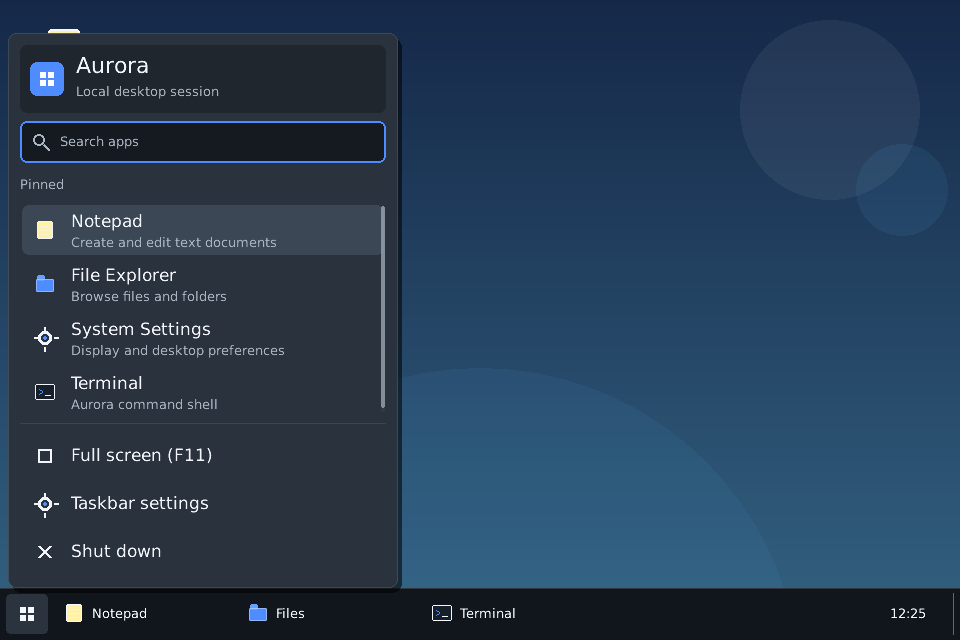

# Desktop-shell correctness

Aurora-D 0.4.5 defines desktop-shell behavior through explicit geometry, popup, identity, and testing contracts. The Start menu, context menus, taskbar tasks, desktop shortcuts, and floating windows remain Aurora-rendered widgets inside one host surface.



## Start-menu layout

`StartMenu` owns its layout instead of relying on a fixed-height generic column. It measures the header, search field, application rows, system actions, separators, margins, and footer, then clamps the panel to the current client rectangle.

The application area is the only scrollable region. System actions and the power row are in a fixed footer. The shutdown action has a 48-logical-pixel row contract and must remain fully inside the menu at every supported client size. The shell regression covers 640×480, 800×600, and 1280×760 clients.

## Transient popup lifecycle

A transient popup registers with the root `PopupController`. Before ordinary pointer dispatch, the host inspects the topmost popup:

```text
press inside popup
    → dispatch normally

press outside popup
    → detach and clean popup subtree
    → hit-test the same press again
    → deliver it to the underlying widget
```

This prevents the common two-click failure where one click only dismisses a popup. Escape and native host focus loss enter the same cleanup path. Cleanup releases capture and removes stale focus, hover, and click-tracking references before detaching the subtree.

Start-button presses are specially consumed when they close their own open menu so the same press cannot immediately reopen it.

## Stable task identity and ordering

Taskbar indices are presentation positions, not identities. Every entry receives a nonzero `TaskEntryId`. Drag state, keyboard selection, hover state, active state, and context-menu targets refer to that stable ID while the visible array is reordered.

A drag can cross any number of neighboring midpoints. The visual order updates immediately, but persistence notification occurs once at release with the completed order. Applications can save and restore the stable order:

```d
TaskEntryId[] order = taskbar.entryOrder();
assert(taskbar.setEntryOrder(order));

taskbar.onEntryOrderChanged = delegate(TaskEntryId[] current)
{
    saveTaskOrder(current);
};
```

`setEntryOrder` accepts only a complete permutation of the current IDs. Duplicate, missing, partial, or unknown IDs are rejected without mutating the taskbar.

## Layout standards

`auditLayout` walks a widget tree and reports:

- negative widths or heights;
- children escaping a declared parent viewport;
- controls smaller than their declared minimum size;
- root overlays that do not cover their parent;
- undersized interactive targets.

Popup overlays declare that they are excluded from normal flex layout and retain explicit full-client bounds.

## UI test driver

`UiTestDriver` sends pointer, wheel, keyboard, text, focus, resize, and DPI events through `GuiWindow`. Tests therefore exercise popup pre-dispatch, hit testing, capture, focus, bubbling, click counting, and detached-subtree cleanup instead of directly calling widget handlers.

The desktop-shell regression includes 320 completed pointer drag reorders, repeated context-menu operations after reordering, click-away redispatch, focus-loss cleanup, search behavior, Start-menu geometry, desktop-icon drop behavior, and stable-order persistence validation.
