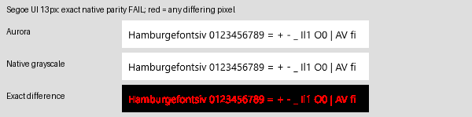
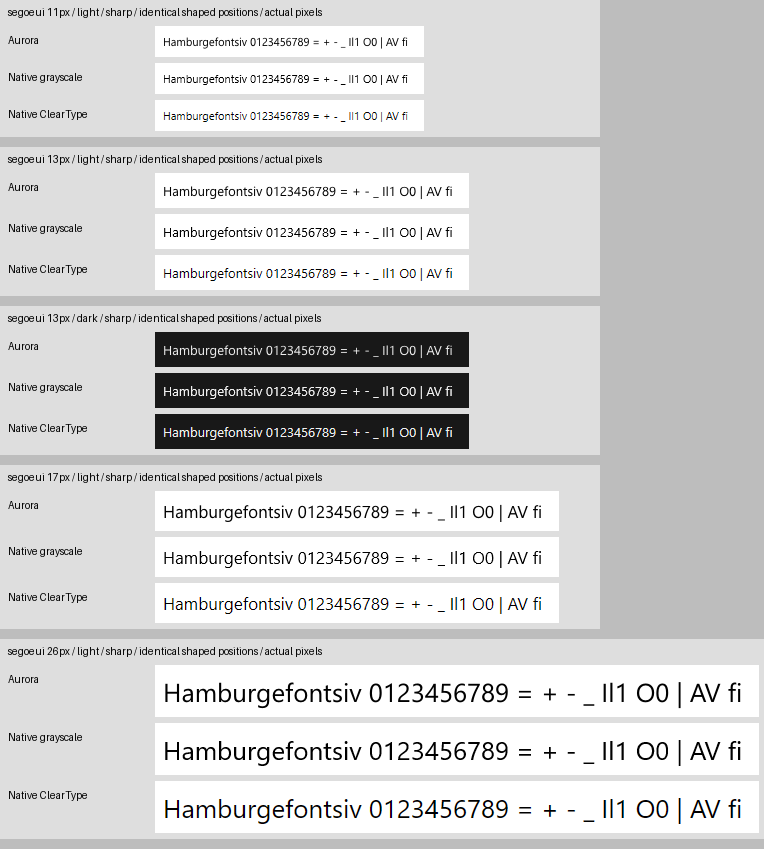
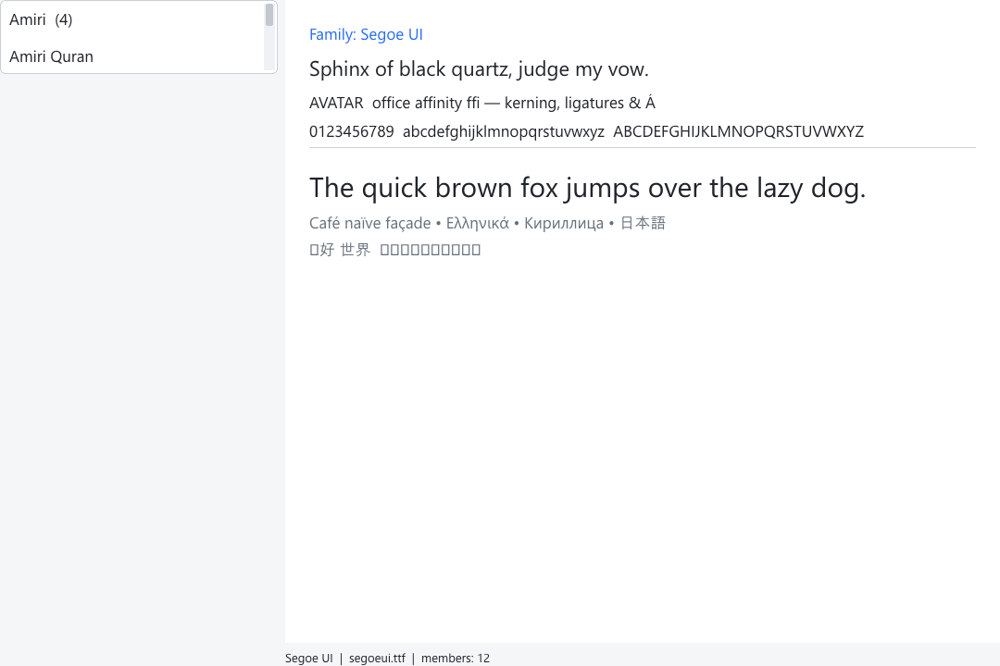
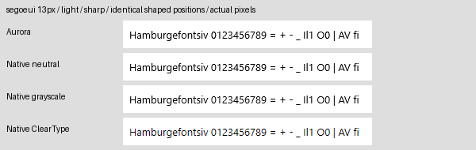
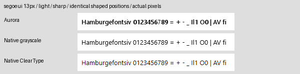

# Segoe UI rendering validation — 2026-09-08

Aurora now preserves fractional glyph advances and uses eight horizontal
coverage phases at small sizes (four at 20px and larger), avoiding rounding
every character to whole pixels. Its
default sharp mode also aligns font-authored lowercase/capital heights at small
sizes. The renderer remains pure D and shares its A8 atlas between software and
Vulkan. Native APIs are used only by the comparison tool.

**Exact native grayscale parity: FAIL.** The zero-tolerance audit found no
pixel-identical cases out of 12 captures, with 26,296 differing pixels in total.
Native reference draws were repeated and matched themselves exactly.

A positioning probe sampled 64 origins across one pixel. On this host, native
Segoe UI grayscale uses eighth-pixel positioning below 20px and quarter-pixel
positioning at larger sizes. Aurora now follows those steps. This removes one
source of mismatch; it does not establish native parity.



## Captures



Each three-row group shows Aurora, native DirectWrite grayscale, then native
DirectWrite ClearType at actual pixel resolution. Both native references load
the same Segoe UI file and draw Aurora's exported glyph IDs at the same shaped
origins. This isolates rasterization; it does not validate native shaping,
ligature selection, fallback, or line layout.



The viewer image comes from its built-in software screenshot mode. The desktop
capture helper failed with `SetIsBorderRequired: No such interface supported
(0x80004002)`, so this is not an on-screen Vulkan capture. The status bar confirms
`segoeui.ttf`. The viewer now prefers an available regular upright face even if
another weight was enumerated first.

## Method and measured differences

An earlier visual sweep covered 18 physical EM sizes: 9–24, 26, and 34 px.
The current exact audit covers 11, 13, 17, 21, 26, and 34 px on light and dark
backgrounds. Raw images, per-size comparison sheets, glyph positions, and a font
hash are saved under `build-validation/font-quality/`. The native rendering
parameters on this machine were gamma 1.8, ClearType enhanced contrast 0.5,
grayscale enhanced contrast 1.0, ClearType level
1.0, and RGB pixel geometry. These are captured rather than assumed by the tool.

Segoe UI SHA-256:
`ba32a222b23d727267cf1aba4e5296fe84ce99b9d910915103fc085d7931bc88`

Exactness is checked on every RGB byte with no tolerance, luminance conversion,
blur, resizing, or cropped comparison. The audit records image hashes, the first
mismatch, differing-pixel counts, and maximum channel error. Diagnostic mean
absolute error remains available, but can never make the exactness gate pass.

| Size | Background | Differing pixels | Maximum channel error | Exactness |
| --- | --- | ---: | ---: | --- |
| 11 px | light | 1035 | 246 | FAIL |
| 11 px | dark | 1036 | 208 | FAIL |
| 13 px | light | 1307 | 212 | FAIL |
| 13 px | dark | 1332 | 180 | FAIL |
| 17 px | light | 1785 | 244 | FAIL |
| 17 px | dark | 1806 | 207 | FAIL |
| 21 px | light | 2306 | 203 | FAIL |
| 21 px | dark | 2315 | 166 | FAIL |
| 26 px | light | 2890 | 156 | FAIL |
| 26 px | dark | 2904 | 149 | FAIL |
| 34 px | light | 3787 | 212 | FAIL |
| 34 px | dark | 3793 | 180 | FAIL |

## Checks

- 37 imported D modules passed their unit tests.
- Six comparison tests verify zero-tolerance equality, a one-level channel
  difference, equal-luminance color differences, dimension mismatches, all 256
  representable A8 theme pairs, and rejection of incompatible theme pairs.
- The checked-in Inter fixture, installed Segoe UI, and a static CFF font passed
  5,256 glyph/size/phase cases, including fractional advance accumulation,
  phase-cache separation/reuse, ink conservation, accents, and nonblank glyphs.
- Immediate Canvas output and DrawList/software replay match exactly in the
  capture harness, on both backgrounds.
- DPI checks cover 125%, 150%, and 200%, including horizontal phase selection and
  unscaled atlas quads.
- Native comparison sheets were also inspected for Arial.
- Font Viewer builds and its named-family screenshot mode succeed.
- The existing text-boundaries test still fails its emoji caret assertion at
  `tests/text_boundaries.d:190`; the same failure was reproduced using the
  original source. Some of that suite's external font fixtures are unavailable.

## Reproduce

From the repository root on Windows, with DMD and Python/Pillow installed:

```sh
python scripts/compare-font-rendering.py --require-exact --sizes 11 13 17 21 26 34
python scripts/compare-font-rendering.py --mode smooth --out build-validation/font-quality/smooth
dmd -unittest -main -run vendor/aurora-d-0.4.5/source/aurora/text/rasterizer.d
```

The `--require-exact` command currently exits with status 1. This is an unmet
acceptance criterion. Without the flag, the script is a diagnostic capture tool;
its exit status does not certify parity.

From `vendor/aurora-d-0.4.5`:

```sh
dub run --config=font-quality-test
dub run --config=dpi-rendering-test
```

Font Viewer accepts an exact family name as its optional screenshot argument:

```sh
aurora-font-viewer.exe --screenshot segoe.ppm "Segoe UI"
```

## Remaining boundaries

### Compositing blocks exactness independently of the glyph outline

An isolated Segoe UI `H` at 13px has 17 native pixels that no single A8 mask
can reproduce across both test themes with Aurora's current blend formula.
For example, native pixel (9,14) is 35 on white and 222 on dark. Matching the
white result forces alpha 220; that alpha produces 210 on dark, not 222.
The diagnostic enumerates all 256 possible alpha values. It uses an isolated
glyph to exclude repeated blending from overlapping glyphs.

This rules out fixing exact parity solely by changing outline rasterization
or cached coverage values. The text compositing model must also change.
This finding does not claim that all portable grayscale renderers are unable
to match DirectWrite. Reproduce with:

```sh
python scripts/compare-font-rendering.py --require-exact --audit-shared-alpha --text H --sizes 13 --out build-validation/font-quality/compositor-audit
```

### Isolating color correction from native coverage

`--audit-neutral` captures an additional native diagnostic using gamma 1.0 and
both contrast controls set to zero. The standard native reference and the
zero-tolerance acceptance gate keep the monitor's original settings. Grayscale
contrast is read separately through IDWriteRenderingParams1; it is 1.0 on this
host, unlike the ClearType contrast value of 0.5.

For isolated `H` at 11, 13, 17, 21, 26, and 34px, all neutral native light/dark
pairs are representable by a shared A8 mask. At the original monitor settings,
22, 17, 46, 35, 34, and 56 pixels respectively are incompatible with Aurora's
existing blend. Aurora still differs from the neutral reference, so outline
hinting/coverage and color correction must both be addressed. Neutral captures
repeat exactly; neither this self-check nor neutral equality certifies native
parity at the required monitor settings.

```sh
python scripts/compare-font-rendering.py --require-exact --audit-neutral --audit-shared-alpha --text H --sizes 11 13 17 21 26 34 --out build-validation/font-quality/neutral-audit
```

### Instruction and native-rendering compatibility

An additional experiment is selected with `AURORA_HINTING=natural`. It implements
sixteenth-pixel horizontal rounding while retaining physical vertical rounding,
directional CVT cut-in/minimum-distance adjustments, and a sampled scan converter.
The scan lattice is 8x1 below 20px and 4x4 at larger sizes, inferred from native
coverage levels and origin probes. The default renderer is unchanged. These are
partial compatibility rules, not a claim of full instruction conformance.

The isolated `H` now matches neutral native pixels on both themes at 13, 17, 26,
and 34px. It still differs at 11 and 21px. The full six-size text corpus has
18,502 differing pixels at monitor settings (0/12 exact captures), versus 26,296
for the default renderer. Native parity therefore remains unmet.



Artifacts: `build-validation/font-quality/natural-lattice-audit/` and
`build-validation/font-quality/natural-lattice-corpus/`. The manifest records the
experimental mode explicitly. Synthetic tests check directional rounding,
sample-boundary ties, clipping, quarter coverage, contour overlaps, and clearing.

The isolated curved glyph `a` at 21, 26, and 34px also reveals neutral-reference
theme discrepancies in the existing A8 blend (8, 11, and 15 pixels). All observed
neutral theme pairs in this probe are consistent with exact sample fractions
and `destination - floor((destination - source) * coverage + 0.5)`. This is an
empirical compositing model to validate against more colors and opacities,
not yet a runtime change or a proven universal native formula. See
`build-validation/font-quality/curve-neutral-audit/`.

The asymmetric hinting rules follow Microsoft's
[ClearType compatibility description](https://learn.microsoft.com/en-us/typography/cleartype/truetypecleartype).

DirectWrite still differs in per-stem hinting, coverage quantization, and
background-sensitive contrast. The experimental bytecode interpreter remains
disabled by default. Repairs now cover size scaling, signed 16-bit CVT entries,
maxp field offsets, shared glyph points, fractional output, ELSE execution,
relative jumps, LOOPCALL argument order, storage/CVT/MIAP/MIRP argument order,
fixed-point multiplication/division, DELTA stack consumption, projection vectors,
and saved size-program graphics state. Focused instruction tests pass.

With `AURORA_HINTING=1`, the Segoe sample now executes without the earlier
undefined-function fallback. The experimental six-size audit still fails all
12 captures, with 25,645 differing pixels after correcting grid rounding and
GETINFO's grayscale capability report. Its average pixel error is worse than
the default path, despite fewer mismatching pixels; this is not a reason to
enable it. Full bytecode conformance and native rendering compatibility remain
unfinished. `AURORA_HINT_DIAGNOSTICS=1` reports fallback errors, and the optional
`AuroraHintTrace` build version traces instructions for debugging. See the
[OpenType CVT definition](https://learn.microsoft.com/en-us/typography/opentype/spec/cvt).

The additional rounding checks cover half-grid, double-grid, signed ties,
round-up/down, and compensation. GETINFO now identifies grayscale instruction
behavior without claiming ClearType or subpixel hinting support. These flags
select different font programs: at 13px the grayscale-hinted strokes are visibly
heavier than the native reference. Modern DirectWrite grayscale compatibility
remains a separate unmet requirement. Instruction semantics are checked against
the [TrueType instruction specification](https://learn.microsoft.com/en-us/typography/opentype/spec/tt_instructions).
The latest experimental captures are in
`build-validation/font-quality/grayscale-hint-audit/`.

The experimental path at 13px (not the shipping default):



Aurora's vertical alignment uses font metadata, not native instructions or a
complete replacement for TrueType bytecode hinting. It leaves fonts without
usable metadata unchanged. ClearType additionally uses RGB subpixel filtering;
Aurora deliberately retains a display-independent grayscale atlas.

Horizontal phase caching can allocate up to eight entries per glyph/size/mode;
only requested entries are rasterized (normal large-text painting uses four).
Physical font size is still rounded to an
integer EM size. Windows validation does not establish Linux/macOS runtime or
on-screen GPU parity. Segoe UI itself must be supplied separately where it is not
installed; no font binary was added by this work. Missing fallback glyphs in the
viewer's multilingual sample remain a separate font-coverage limitation.

Reference APIs: [DirectWrite rendering overview](https://learn.microsoft.com/en-us/windows/win32/directwrite/introducing-directwrite),
[grayscale antialiasing](https://learn.microsoft.com/en-us/windows/win32/api/dwrite_1/nf-dwrite_1-idwritebitmaprendertarget1-settextantialiasmode),
[native bitmap capture](https://learn.microsoft.com/en-us/windows/win32/api/dwrite/nf-dwrite-idwritebitmaprendertarget-getmemorydc).
